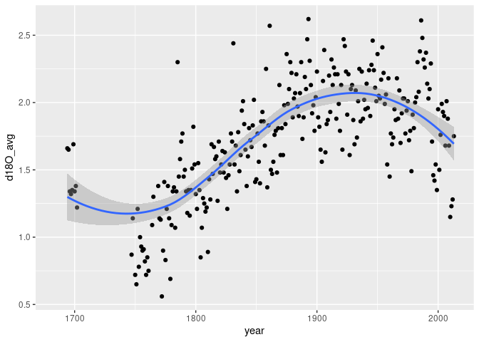

WDS-paleo
================

AN R package for reading and managing NOAA’s [wds-paleo text
format](https://www.ncei.noaa.gov/products/paleoclimatology/contributing-data)

There doesn’t seem to be a lot of documentation around this format, but
it appears to be self-documenting enough to be easy to parse.

### Requirements

-   [R v4.1+](https://www.r-project.org/)

-   [R6](https://CRAN.R-project.org/package=R6)

-   [dplyr](https://CRAN.R-project.org/package=dplyr)

-   [readr](https://CRAN.R-project.org/package=readr)

-   [ggplot2](https://CRAN.R-project.org/package=ggplot2)

### Installation

    remotes::install_github("BigelowLab/wdspaleo")

### Usage

#### Initialize a connection

``` r
library(wdspaleo)
library(ggplot2)
filename = example_filename("seguin_whitney2022")
print(filename)
```

    ## [1] "https://www.ncei.noaa.gov/pub/data/paleo/contributions_by_author/whitney2022/seguin_whitney2022.txt"

``` r
X = WDS_paleo(filename)
X$data
```

    ## # A tibble: 330 × 7
    ##     year d18O_avg d18O_sd d15N_start_year d15N_end_year d15N_avg d15N_sd
    ##    <dbl>    <dbl>   <dbl>           <dbl>         <dbl>    <dbl>   <dbl>
    ##  1  1684       NA      NA              NA            NA       NA      NA
    ##  2  1685       NA      NA              NA            NA       NA      NA
    ##  3  1686       NA      NA              NA            NA       NA      NA
    ##  4  1687       NA      NA              NA            NA       NA      NA
    ##  5  1688       NA      NA              NA            NA       NA      NA
    ##  6  1689       NA      NA              NA            NA       NA      NA
    ##  7  1690       NA      NA              NA            NA       NA      NA
    ##  8  1691       NA      NA              NA            NA       NA      NA
    ##  9  1692       NA      NA              NA            NA       NA      NA
    ## 10  1693       NA      NA              NA            NA       NA      NA
    ## # ℹ 320 more rows

``` r
ggplot(data = X$data, aes(x = year, y = d18O_avg)) + 
  geom_point() +
  geom_smooth(se = TRUE)
```

    ## `geom_smooth()` using method = 'loess' and formula = 'y ~ x'

    ## Warning: Removed 60 rows containing non-finite values (`stat_smooth()`).

    ## Warning: Removed 60 rows containing missing values (`geom_point()`).

<!-- -->
